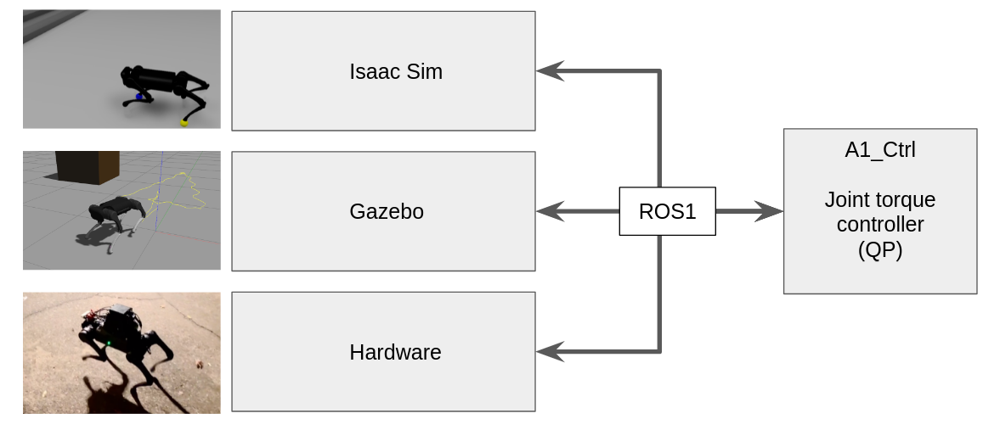
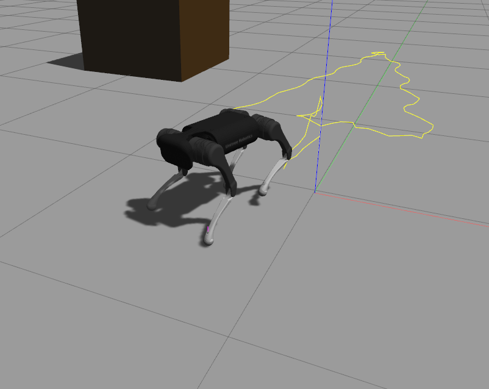
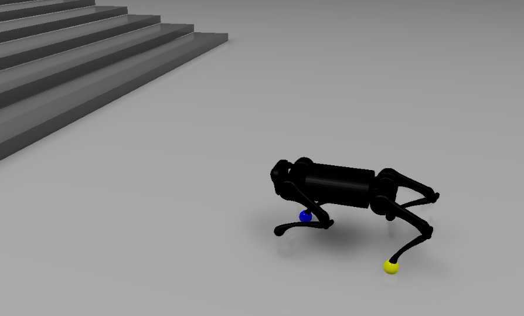

# A1-QP-MPC-Controller
## Introduction

This repo provides a quadruped control stack that controls the Unitree A1 robot, one of the most popular quadruped robots used in academic research in recent years. This control stack implements two famous model base control methods [1][2]. Additionally, we use Docker and ROS1 to make it easy to install and develop.

To facilitate quadruped research and application development, we provide interfaces to use this controller to control either simulated robots or real robots. We support following types of robots

    1. A1 Robot simulated in Gazebo Simulator
    2. A1 Robot hardware
    3. A1 Robot simulated in Nvidia Isaac Sim Simulator 

Even if you do not have an A1 robot hardware, our simulation setup can let you do research in either the Gazebo simulator or the Nvidia Isaac Sim simulator. Various efforts have been done to reduce the sim2real gap in this work. 

The features of this controller include

    - real time QP force controller [1] (500Hz)
    - real time convex MPC controller [2] (400Hz)
    - Proprioceptive sensor state estimation [1]
    - Terrain adaption (up to 30 degree)
    - 9cm staircase climbing (only tested in Gazebo, hardware test ongoing)
    - Docker based installation
    - Intergrated ROS1 ecosystem

### Demonstration Videos

[](https://www.youtube.com/watch?v=TP46zgruig4)

[](https://www.youtube.com/watch?v=wiJ8pOM8Wj4)

The controller software is architected in a way aiming to provide multi-platform support and easy integration with other existing ROS packages 
contain SLAM, mapping and motion planning algorithms. 


For more details about the controller principle please refer to 

[1] Bledt, Gerardo, et al. "MIT Cheetah 3: Design and control of a robust, dynamic quadruped robot." 2018 IEEE/RSJ International Conference on Intelligent Robots and Systems (IROS). IEEE, 2018.


[2] Di Carlo, Jared, et al. "Dynamic locomotion in the mit cheetah 3 through convex model-predictive control." 2018 IEEE/RSJ International Conference on Intelligent Robots and Systems (IROS). IEEE, 2018.

## Controller Installation

We assume you already have [Docker](https://www.youtube.com/watch?v=3c-iBn73dDE) installed on your computer because we recommend that the controller being installed in a Docker container, so on different computers (desktop for simuation, onboard computer for hardware control), the controller can run in a common environment. 

The software is tested in **Ubuntu 18.04** and **Ubuntu 20.04**. 

First, open a terminal and go to the "docker/" folder. Build the docker using command

```shell
docker build -t a1_cpp_ctrl_image .
```

Then we start docker by the following command (you may add sudo depending on your docker permission setting.)

```shell
    docker run -d \
    --network host \
    --cap-add=IPC_LOCK --cap-add=sys_nice \
    -v PATH_OF_THE_REPO_ON_YOUR_HOST_COMPUTER:/root/A1_ctrl_ws/src/A1_Ctrl \
    --device /dev/input \
    --name a1_cpp_ctrl_docker \
    a1_cpp_ctrl_image
```
Notice the *PATH_OF_THE_REPO_ON_YOUR_HOST_COMPUTER* must be changed to the location of the repo folder on your computer. The argument **--device /dev/input** intends to [map USB ports into the docker container](https://marc.merlins.org/perso/linux/post_2018-12-20_Accessing-USB-Devices-In-Docker-_ttyUSB0_-dev-bus-usb-_-for-fastboot_-adb_-without-using-privileged.html) so you can attach joystick to the host computer and use ROS joy_node to receive joystick command. 

We set the docker container in a way that we use ssh to access the controller. Once the docker container starts, use 

```shell
ssh root@localhost -p2233
# then input passward "password" when prompted to do so
cd /root/A1_ctrl_ws/
catkin build
```

We do it in this way because during development period, we can use VSCode remote or Clion to debug the program. You can read the Dockerfile about how to change default username, password and ssh port. 

We recommend VSCode remote but Clion is also handy to use. You can read the docker file and a tutorial at https://www.allaban.me/posts/2020/08/ros2-setup-ide-docker/ to learn more about Clion development. (The tutorial is for ROS2 but most part of it applies to ROS1 too.) Following this article you can set CLion to compile the controller using the environment in the docker container. Additional to "Copy and paste the output into CLion’s CMake environment setting."
also need to copy environment variables to "Run/Debug Configrations" of the executable to be tested. 

With the above docker container configuration, inside the docker, /root/A1_ctrl_ws/ is a regular ROS1 workspace. Execute ''catkin build'' to build the workspace. Then the ROS package a1_cpp in A1_ctrl_ws is ready to use.

## Gazebo Demo


We provide a second Dockerfile to make sure you can install the Gazebo simulator on any Linux machine (with Nvidia graphics card if possible). We will only talk about how to setup for machine with Nvidia graphics card. 

If you want to use your existing ROS environment or want to install on the host computer directly, notice the Gazebo demo relies on the gazebo simulator environment developed by Unitree Robotics. However, the official environment is updated to support Unitree's new robots. So the version of unitree_legged_sdk should be manually changed to v3.2. Also, notice ROS melodic supports up to Gazebo 9, so please use Gazebo version < 9.

### Setup
On the host computer, build a second docker in "gazebo_docker" folder

```shell
docker build -t a1_unitree_gazebo_image .
```

Now we need to be careful about the graphics card of the host computer. If the host computer uses Nvidia graphics card. Then we need to install nvidia-docker2. Read [this link](http://wiki.ros.org/action/login/docker/Tutorials/Hardware%20Acceleration) for more information if other hardware is used. 

Assuming an Nvidia graphics card is used, and Nvidia driver is properly installed. First follow [this link](https://nvidia.github.io/nvidia-docker/) to add nvidia-docker repo to your host computer, then install the nvidia-docker2 follows [the instruction](https://docs.nvidia.com/datacenter/cloud-native/container-toolkit/install-guide.html#docker).

Then on host computer, type
```shell
xhost + 
```
Then we create a script to run the image called run_gazebo_docker.bash

```shell
XAUTH=/tmp/.docker.xauth
if [ ! -f $XAUTH ]
then
    xauth_list=$(xauth nlist :0 | sed -e 's/^..../ffff/')
    if [ ! -z "$xauth_list" ]
    then
        echo $xauth_list | xauth -f $XAUTH nmerge -
    else
        touch $XAUTH
    fi
    chmod a+r $XAUTH
fi

docker run -it \
    --env="DISPLAY=$DISPLAY" \
    --env="QT_X11_NO_MITSHM=1" \
    --volume="/tmp/.X11-unix:/tmp/.X11-unix:rw" \
    --env="XAUTHORITY=$XAUTH" \
    --volume="$XAUTH:$XAUTH" \
    --runtime=nvidia \
    --privileged \
    --network host \
    --name a1_unitree_gazebo_docker \
    a1_unitree_gazebo_image
```

After you run this script once, later you can access the docker "a1_unitree_gazebo_docker" by
```shell
docker start a1_unitree_gazebo_docker
docker attach a1_unitree_gazebo_docker
```

If more terminals are needed, use the following command to add more terminals
```shell
docker exec -it a1_unitree_gazebo_docker bash
```
 
In the docker container, run the following command to start the gazebo environment 

```shell
roslaunch unitree_gazebo normal.launch rname:=a1 wname:=stairs_single 
```

The gazebo window should be seen on the host computer. Check [the list of worlds](https://github.com/ShuoYangRobotics/unitree_ros/tree/master/unitree_gazebo/worlds) for different wname.

### Adjust the robot in the Gazebo
During the development, we can let the robot stand up by two Unitree testing scripts. The following two commands are very handy.
```shell
rosrun unitree_controller unitree_servo # let the robot stretch legs
rosrun unitree_controller unitree_move_kinetic # place the robot back to origin
```
We oftern running the two commands alternatively by running one and ctrl-C after a while to adjust the pose of the robot.
After the robot properly stands up, it is ready to be controlled. 

### Start the controller

If you have completed the instructions before, there should be a runnable docker container called `a1_cpp_ctrl_docker` in your computer. 
Run the container, build and config the A1 controller
```shell
ssh root@localhost -p2233
# then input passward "password" when prompted to do so
cd /root/A1_ctrl_ws/
catkin build
source /root/A1_ctrl_ws/devel/setup.bash
echo "source /root/A1_ctrl_ws/devel/setup.bash" >> /.bashrc
```
In the docker container, continue to run the controller
```shell
roslaunch a1_cpp a1_ctrl.launch type:=gazebo solver_type:=mpc # solver_type can be qp or mpc
```

Now, the controller engages the robot in Gazebo. The robot has two modes: "stand" (default) and "walk". The robot still stands at the beginning. If using QP controller, your robot may be not very stable when standing up, you can use the two unitree_controller commands we mentioned above to adjust the robot to make it stands up first. The Convex MPC controller is more stable. 

Different computers have different performance. If the robot is very unstable, chances are the simulation parameters of the Gazebo needs to be tuned (unitree_ros/unitree_gazebo/worlds). See [Gazebo tutorial](https://gazebosim.org/tutorials?tut=physics_params&cat=physics) for more information.

If there is a USB joystick connects to the host computer. The docker should be able to see it (because when we run the docker container, we use **--device /dev/input** to map USB input devices into the docker). So we can read its data in the docker. Open another terminal
```shell
ssh root@localhost -p2233
rosrun joy joy_node
```

Currently, we need a Linux-supported joystick like an Xbox One Controller to drive the robot around.
You should follow the instructions in http://wiki.ros.org/joy/Tutorials/ConfiguringALinuxJoystick to learn how to setup a joystick controller.

Take Xbox One Controller as an example:

| Button | Function |
| :----- | :------- |
| Left Joystick | Control the robot's yaw orientation |
| Right Joystick | Control the robot's walking direction |
| `A`| Switch the mode between "stand" and "walk" |

## Hardware Robot Demo


We install an Intel NUC i7 computer on the A1 robot. We assume this computer connects to the robot LAN network already.
When the robot has power, the onboard computer should have IP address 192.168.123.X.

**Again, be very careful about the unitree_legged_sdk version, it must use v3.2 or v3.3.1.** The official repo of Unitree SDK is updated to support Unitree's new robots. So A1 users must manually check out v3.3.1 branch:
https://github.com/unitreerobotics/unitree_legged_sdk/releases/tag/v3.3.1. Our docker should already handle this but just be careful. 

Download the Dockerfile in "docker/" on the onboard computer and compile the docker
```shell
git clone https://github.com/ShuoYangRobotics/A1-QP-MPC-Controller.git
cd docker/
sudo docker build -t a1_cpp_ctrl_image .
```

Then we start docker by

```shell
    docker run -d \
    --network host \
    --cap-add=IPC_LOCK --cap-add=sys_nice \
    -v PATH_OF_THE_REPO_ON_YOUR_HOST_COMPUTER:/root/A1_ctrl_ws/src/A1_Ctrl \
    --privileged \
    -v /dev/bus/usb:/dev/bus/usb \
    --name a1_cpp_ctrl_docker \
    a1_cpp_ctrl_image
```
Then get insider the docker by 
```shell
docker start a1_cpp_ctrl_docker
```
and then
```shell
ssh root@localhost -p2233
# then input passward "password" when prompted to do so
```

Go to folder "/root/A1_ctrl_ws/", then do 
```shell
catkin build 
source /root/A1_ctrl_ws/devel/setup.bash
echo "source /root/A1_ctrl_ws/devel/setup.bash" >> /.bashrc
```

Make sure the A1 robot is in "standby" mode, in which the robot is ready to receive joint commands. There are two ways to do this.
The first approach is very hacky (but also handy): When A1 robot's battery turns on, 
the robot will first do an initialization sequence and then run its built-in controller.
If now the onboard computer sends a command with all 0 (or you directly run our controller and stop is after a while), the built-in controller will be 
interrupted, and the robot enters standby mode. The second approach is after the robot starts 
and stands up, press "L2+B" buttons on the A1 remote controller. 

Now the A1 robot is in standby mode, we can run controller from the docker. Inside the docker, use a roslaunch file to start the controller 
```shell
source /root/A1_ctrl_ws/devel/setup.bash
roslaunch a1_cpp a1_ctrl.launch type:=hardware solver_type:=mpc
# notice the type is different from the Gazebo or Isaac simulation; solver_type can be qp or mpc, we recommand mpc
```

The robot should stand up now using our controller. If now there is a joy command in the
ROS environment (come from either an XBox joystick attaches to the robot or from
another device in the network), the robot can respond to the joy command the same way
as that in the Gazebo demo. 

## Isaac Sim Demo


We can use this controller to control an A1 robot in Nvidia Isaac Sim. This functionality is still under development. It will work with the next Isaac Sim release.

## Troubleshooting
Please create issues for any installation problem. 

## Acknowledgement
We referenced the controller architecture written by Dr. Xinye Da, General Manager of PX Robotics. 

Zixin Zhang implemented a part of the convex MPC controller and the terrain adaption feature.  
